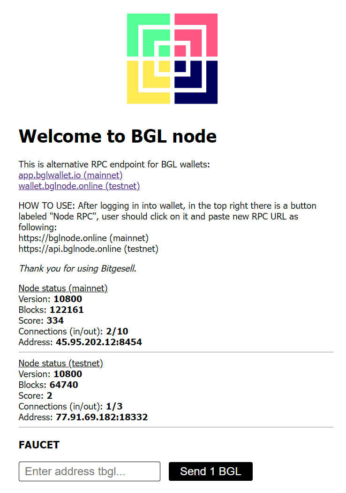

This is alternative RPC endpoint for BGL wallets:

Mainnet [app.bglwallet.io](https://app.bglwallet.io) RPC endpoint: https://bglnode.online

Testnet [wallet.bglnode.online](https://wallet.bglnode.online) RPC endpoint: https://api.bglnode.online

Available methods: getblockcount, getconnectioncount, getblockchaininfo, getnetworkinfo, sendrawtransaction.
